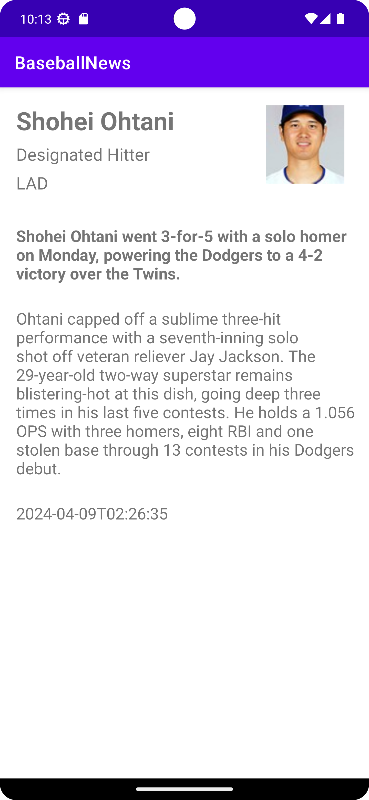

# Baseball News
In this repository, it is shown the main part of scripts how this project works. 

## Description for Script
This small project is contained three main parts as below:

Part 1. Scrapy news data. The scripts are
    
    ScrapyNews.cs
    Form1.cs

Part 2. Data communication with ms-sql. The API scripts is written in
    
    BaseballNewsController.cs

Part 3. Data demonstration which is created by java and showing on android device. All scripts is cntained in baseballnews folder. The main script is
    
    MainActivity.java

## Overview
There are including the following procedures and its corresponding scripts
- Scrapying data from NBC sports news.

- Sending data to local data base.

- Exporting data from data base and showing off on android emulator.

